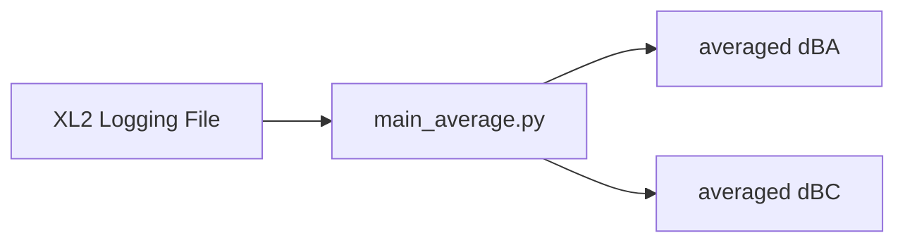
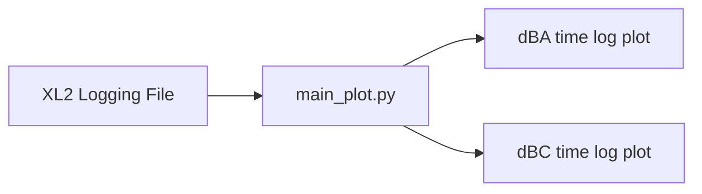
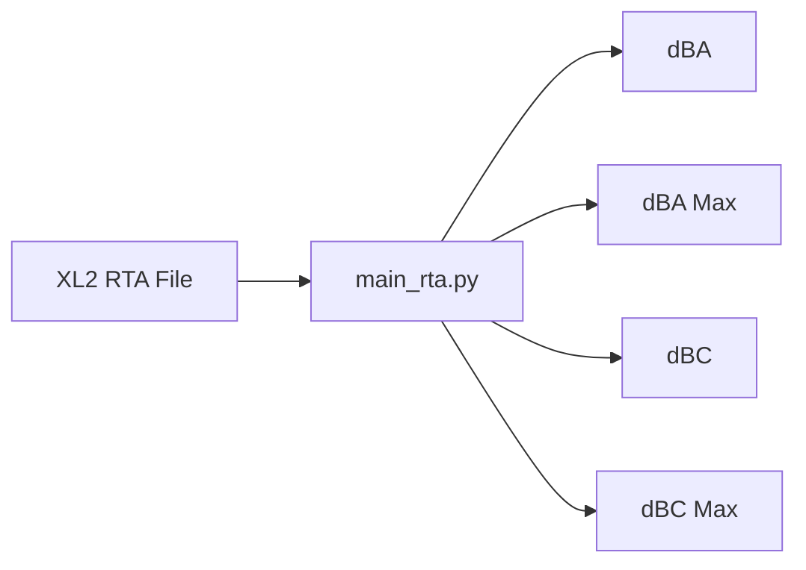
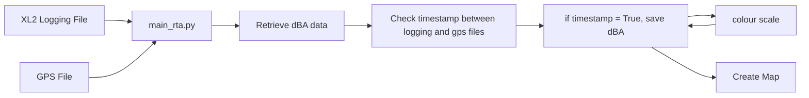

# soundmap_os
This repository helps automate "soundwalk" process by integrating gps data (tcx file) and sound logging file (txt file).

## Hardware Dependencies
1. GPS module (Google Pixel Watch 2)
2. Sound Level Meter (NTi XL2)

## Software Dependencies

### Python Packages
Refer to [**requirements**](/requirement.txt)
```
pip install folium
pip install pandas
pip install matplotlib
```

## Operation

### main_average.py

This python file import `XL2 Logging File` and averages the following measurement readings for the entire logging duration.
1. dBA 
2. dBC 



### main_plot.py 

This python file import `XL2 Logging file` and plot the following measurement readings into line graphs (`png` format) for the entire logging duration using `matplotlib`.
1. dBA 
3. dBC 



### main_rta.py

This python file import `XL2 RTA file` and plot the following averaged measurement readings into bar graphs (`png` format). The dataset is recorded in `dBZ` and the python file is using a band weighting offset scale to calculate the corresponding `dBA` and `dBC` RTA graphs. 

**For offset values less than 0, the bar will not show any data**



### main_soundwalk.py

This python file will import both `XL2 Logging File` and `GPS file`. It will retrieve `dBA_dt` value from logging file. The program will then compare the corresponding dBA's timestamp from Logging File to GPS file. If there are corresponding timestamp, the program will map the value into `openmap`. The program will output an `html` file to illustrate the sound mapping over a district.

Below details the colour scale for the Noise Level Mapping


